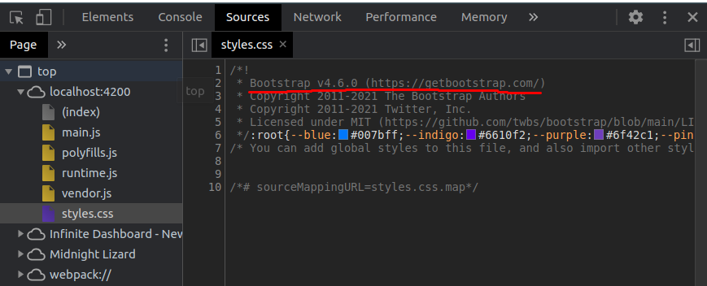

# [PreConcepts](#PreConcepts)

## 1. Before installing angular let's remove the existing ones
---
1. update nodejs from reinstalling LTS version
1. updating cli
    ```
    [sudo] npm uninstall -g angular-cli @angular/cli 
    npm cache verify 
    [sudo] npm install -g @angular/cli 
    ```
1. official angular cli: [here](https://angular.io/cli)

## 2. create project
---
1. First angular project created with cli : ```ng new project-name```

2. run angular project: ```cd new-project-name && ng serve```
3. Inside of new -project-app
   1. e2e folder in new-project-app is for end 2 end testing
   2. src has all the source code of project, which has app folder
   3. in the page source code, we can ```<app-root>``` tag where angular searches for this tag and then places all the complied code present in src/app folder in run-time.
   4. Thus html page present in src/index.html is loaded first
   5. then angular loads compiled content from ```<app-root>``` in run time
4. Adding bootstrap to angular project
   1. install npm packg : ```npm install --save bootstrap```
   2. this will install bootstrap locally to project
   3. In order to use above module, import it in root > angular.json (projects > project-name > architect > build > styles) file as

        ```typescript
        "styles":[
            "./node_modules/bootstrap/dist/css/bootstrap.min.css",
            ...,
            ]
        ```
        and then run ``` ng serve```
    1. then from the inspect tools of your browser, go to sources > styles.css 
    you can see the following (bootstrap is being injected/imported in project startup)
    
    which means that everyhting worked out and added properly added in ptoject
   
## Ngmodel
---
2 way data-binding in angular
example : paste code in src > app > app.component.html
```html
<!-- takes a input from user -->
<input type="text" [(ngModel)]="name">
<!-- then display the content from the above input without any intermediate functions -->
<p>{{name}}</p>
```

In order to above work, you need to import a lib in to your app.module.ts

```typescript
import { FormsModule } from '@angular/forms';
[...]

@NgModule({
  imports: [
    [...]
     FormsModule //add imported module in imports array
  ],
  [...]
})
```
---

# [CourseStructure](#CourseStructure)

1. getting started (like now)
2. basics of angular
3. components and binding
4. directives
5. services and dependency injection
6. routing
7. observables (work with async code)
8. handling forms
9. pipes
10. http module (API's)
11. authentication
12. optimizations and NgModules
13. deployment
14. Animations and testing
    
# [TypeScript](#TypeScript)

* Super set of javascript
* its a strongly typed, you need to define the type of variable
* In runtime, it is complied to javascript by the angular cli and that javascript code is ran in browser 