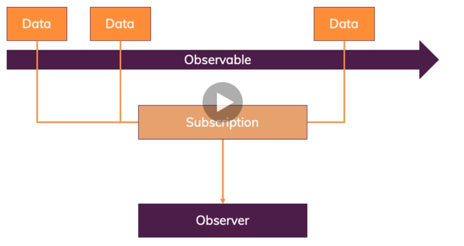
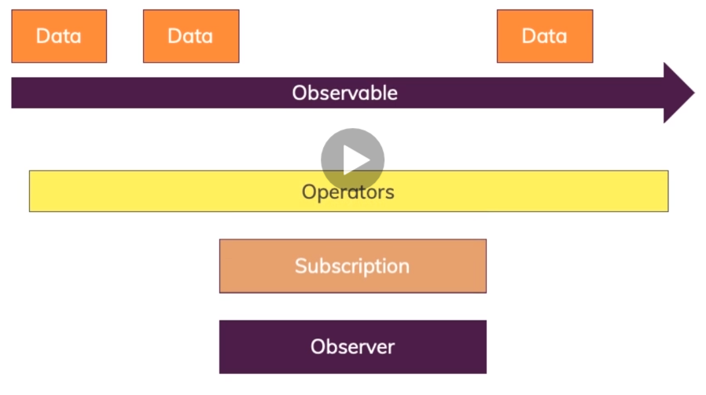

# Observables

## what it is?

* In general, its just like a data source like events (user inputs), Http requests, events triggered in code etc.
* But In angular, it is a package we import from ```rxjs/Observables```(third party) which follows Observable pattern
* Which means we have following parts 
    1.Observable : event or data thrown by this agent via events, http request or via code.
    2.Oberserver/Subscriber : event or data thrown by above agent will be received by this agent.Then later based on this data received we modify code to act upon that data. This is where we write our code in angular to act upon received data.
    * **_The data which recevied here is handled asynchronously_**.
    * **_These are like callbacks and promises but use a different approach to handle data_**
    * Angular uses observables a lot and its major advantage is
    * There are 3 ways of handling this data/hooks:
        1. Handle data:
        2. Handle error:
        3. Handle Completion:

## Analysing angular observables
Current Project : [here](../obs-01-start/obs-01-start/)

## Creating our own observables

1. observables are not built in javascript not typescript but added via third party module called as RXJS.
2. thus to build  one first import RXJS in required component.ts file
3. Note: You dont need to do the anything as like now for observable/subscriber because typescript can understand observers/subscribers
4. ## ways of creating custom observable:
    
    4.1 : ```interval``` method on rxjs module: this module is same as setInterval in javascript. Calling/throwing event at every x milli-seconds. Now these can be caught by subscriber method attached to interval. ### These event should be stopped manually, else it can lead to memory leak issues in applications. This is the main reason why we store the subscriptions in a variable in typescript class, and using those references we can ```unsubscribe``` method to stop our events when they are not necessary. Ex [here](../obs-01-start/obs-01-start/src/app/home/home.component.ts) <br>
    
    4.2 :  custom Observable 1: you can create custom observable via ```Observable.create()``` with following syntax(Note it is given by rxjs library)

    ```typescript 
    import {Observable} from 'rxjs';
    ..
    ..
    // creating custom observable
    let obs = Observable.create(
        //this below param to anonymous function is given automatically by rxjs
        //this param is responsible for creating event/ throwing data to observable when available
        (observer)=>{

                //now throwing an event to from current obeserver object
                observer.next(); // send data
                observer.emit(new Error('Your Error Message')); // 1. sends error 2. when observer throws error its subscription and event/data throwing is stopped. 3. Note when error is thrown then below event complete will not be thrown after emitting error.
                obeserver.complete(); // send complete event, Note: this method doesnt have any arguements & Subscriptions will be stopped automatically

        }
    );
    // fetching data from above obeservable
    let sub = obs.subscribe(
        ()=>{.....handling the data here}, //data thrown by Observer.next is handlied here
        (err)=>{.....handling the error here}, // data thrown by Observer.error is handled here
        ()=>{......handling end data here} // data thrown by Observer.complete is handled here 2. Majorly used for clean up works
    );
    // to remove subscription, use
    sub.unsubscribe(); // remember to use this else application can have memory leaks
    ```
## Understanding Opertors:

### Data flow with observables and subscribers <br>



### Data flow with observables, operators and subscribers <br>



* Opertors are nothing but the middlewares present in between observables and subscribers which are oftenly used in data changes/verifications.

* Operators are generally used on the data modifications done on built in observables as we cant modify code of observable to modify the structure of our needed data
* You can attach a opertor to observable via calling method ```pipe``` 
* You can check use various operators from ```rxjs/operators```
* You can have multiple operators on a single observable and subscriber in a single pipe method
## Note : if you want to use operators then you must use it subscriber that is 

```typescript
observer.pipe((.....))
let sub = observer.subscribe(()=>{....}) //doesnt work

let sub = observer.pipe((...)).subscribe(()=>{....})//will work
```

There are various operators are present in RXJS, you can find them #[here](https://www.learnrxjs.io/learn-rxjs/operators)