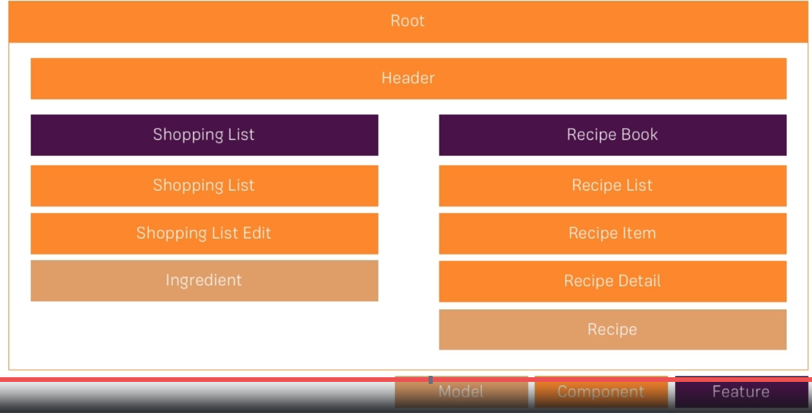
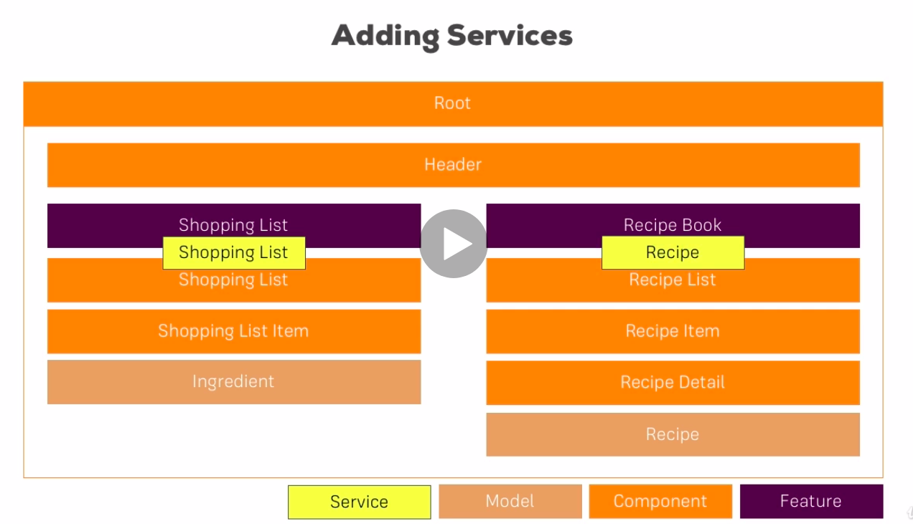

# Plan

Feature - service



## Setting Up Project

1. add bootstrap to project via npm and add it to angular.json
2. Creating Components
   1. Header -> inside app , then add ```<app-header></app-header>``` in first line of app.component.ts
   2. Recipies -> inside app
   3. RecipeList -> inside app > recipe
   4. RecipeDetail -> inside app > recipe
   5. RecipeItem -> inside app > recipe > recipe-list
   6. ShoppingList -> inside app
   7. ShoppingEdit -> inside app > shopping-list
3. Header
4. Recipe List
   1. Make a proper structural for recipe,as it would be used in through out the project. this is called as modal.
   2. thus create a file ```recipe.modal.ts``` in recipies component's folder
5. ShoppingList : created Ingredients modal in app/shared folder as it can be used in both recipies and shopping list components

## [Continuation Section 12](Routes) : Adding Routting Features to Project

### Task

1. Add Routes that are related to your application in routes array present in ```app-routing.module.ts``` in Project Folder.
2. After build routes, update the header to work on routes instead of ngIf blocks.
3. Mark Appropriate Header link with active router link (Hint use routerLinkActive directive)
4. whenever we click on recipe item, page will be reloaded, now load recipe item via route(child routes)