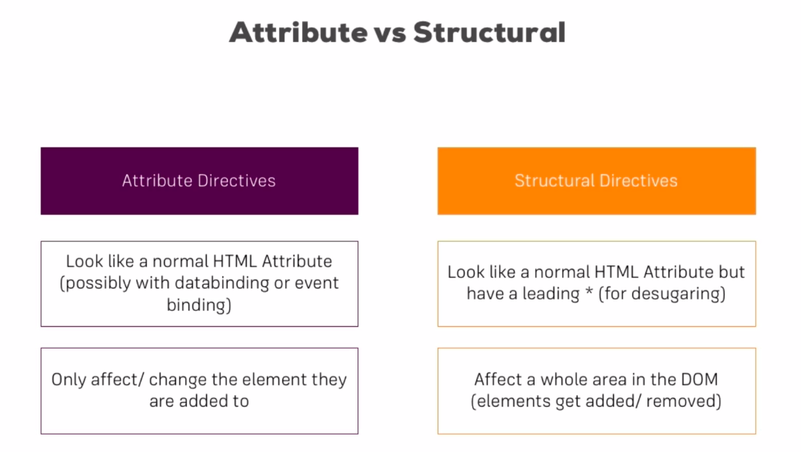

# Directives Deep Dive

(For concepts refer [here](../directives-start/src/app/customDirective/customDirective.directive.ts))

* Directives are of 2 types : Attribute and Structural

| Attribute | Structural |
| --- | --- |
| used on attributes of html elements | also used on attributes but they do change the DOM of around elements|
| example ngStyle, ngClass | example ngIf|



# Attribute Directives:

1. ngStyle

1. ngClass
1. ## creating our own attribute directive:
    1. create a folder in app with your directive name
    1. create a new file with your-directive.directive.ts / you can create directly with angular cli: ```ng g directive <name>```
    1. keep all of your directive code in it
    1. then declare your custom directive in ```app.module.ts``` in ```declarations``` array
    1. then you can the directive in declared component as attribure directive
1. ## Using Renderer to build better Attribute Directive
    1. we cannot access the HTML/DOM elements directly in angular as it is not safe
    1. This is beacause the shadow DOM usage in the angular, since the element may present sometime and after sometime it isnt
    1. For this purpose, we use another Injector called as **Renderer**
    1. [Here](https://angular.io/api/core/Renderer2) is the complete documentation of **Renderer**
    1. [test file](../directives-start/src/app/betterCustomDirective/better-custom-directive.directive.ts)
1. ## HostLinstener Directive : This is majorly used to listen all the events of DOM Elements
    1. [Here](https://angular.io/api/core/HostListener) is complete documention of **HostListener**
    1. [test file](../directives-start/src/app/betterCustomDirective/better-custom-directive.directive.ts)
1. ## Host Binding : for small dom changes it is better to use this decorator
1. ## Binding to Directive Properties.
    1. as we learnt building custom directives, consider a scenario where we need to pass some data to directive from component
    1. for this purpose we use the property binding
    1. lets use the property binding on custom directive : [test file](../directives-start/src/app/app.component.html)
    1. observe code :

        ```html
        <h2 
        appBetterCustomDirective
        defaultColor="yellow"
        [highlightColor]='"green"' > <!-- when we use [] we need to send data with type -->
            Styling with the Renderer
        </h2>
        ```

    1. Now that code contains both custom directives and custom properties on same HTML Tags.
    1. Both of considered as properties where angular actually able to differentiate the custom directives and custom properties
    1. not only that is able to send all the properties to custom directive
    1. hence this code is to show that we can bind the properties present in custom directives via property binding
    1. please note the values which are passed via property binding.


# Structural Directives

## Why do we use * in structural directives

1. indication that paticular directive is structural to angular
1. indication is required because angular tends to convert them to custom DOm elements in Shadow DOM
    Example: <br>
    Original code: ```<div *ngIf='expression'>...</div>``` <br>
    Actual Code  : ```<ng-template [ngIf]='expression'> <div>...</div> </ng-template>```
1. Building Custom Structural Template
    1. the requirements are : ```template where``` it is used and ```place where to render``` the structural directive in template. [test file](../directives-start/src/app/unless/unless.directive.ts)
    1. thus after getting required inputs we need to execute/change the code whenever there is change in the input/condition given to structural directive
    1. for this purpose we use ```set``` keyword, followed by method name same as the directive's selector. [test file](../directives-start/src/app/unless/unless.directive.ts)
    1. this is because angular, internally converts the structural directives to property binding as point 2. (check *unless directive)[test file](../directives-start/src/app/app.component.html)

1. NgSwitch Directive.